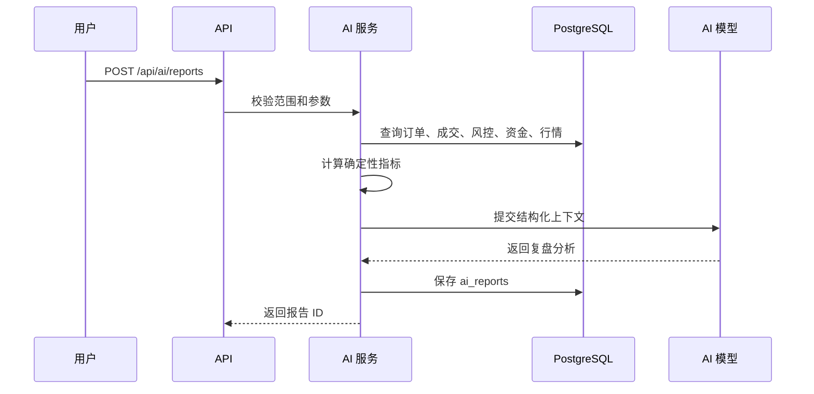

# AI 分析设计

> **相关能力**：除盘后复盘报告外，系统还提供 **AI 自然语言策略定义生成**（见 [strategy-builder-design.md](strategy-builder-design.md) §AI 自然语言生成）。两者共用 `ai_client` 配置，但职责分离：复盘只读历史数据；策略生成只输出 DSL JSON，不触发交易。

## 目标

AI 分析模块读取历史交易、策略表现、行情和风控记录，生成复盘报告、风险归因和策略改进建议。AI 不参与实时交易决策，不允许直接或间接触发下单。

## 数据输入

| 数据 | 来源 |
| --- | --- |
| 历史订单 | `orders` |
| 历史成交 | `trades` |
| 策略信号 | `strategy_signals` |
| 风控检查 | `risk_checks` |
| 账户资金曲线 | `account_assets` |
| 持仓变化 | `positions` |
| 行情 K 线 | `kline_bars` |
| 系统异常 | `system_events` |

## 报告范围

用户可选择：

1. 自然日、周、月。
2. 自定义时间范围。
3. 指定策略。
4. 指定标的。
5. 指定市场：股票、期货或全部。

报告必须记录数据范围、过滤条件、生成时间和模型名称。

## 指标计算

AI 调用前应由后端先计算确定性指标，避免模型自行编造：

| 指标 | 说明 |
| --- | --- |
| total_pnl | 总盈亏 |
| daily_pnl | 日度盈亏 |
| win_rate | 胜率 |
| profit_loss_ratio | 盈亏比 |
| max_drawdown | 最大回撤 |
| trade_count | 交易次数 |
| fee_total | 手续费 |
| slippage_estimate | 滑点估算 |
| risk_reject_count | 风控拒绝次数 |
| circuit_breaker_count | 熔断次数 |
| consecutive_loss_count | 连续亏损次数 |

AI 报告只能引用这些指标和查询结果。

## 报告结构

```json
{
  "summary": "总体表现摘要",
  "metrics": {},
  "strategy_ranking": [],
  "loss_attribution": [],
  "risk_events": [],
  "abnormal_patterns": [],
  "improvement_suggestions": [],
  "limitations": []
}
```

前端可将 JSON 渲染为结构化报告，也可保存生成后的 Markdown 文本。

## 安全边界

1. AI 只读数据库聚合结果和必要明细。
2. AI 不访问 SDK 适配器。
3. AI 不调用策略、风控、订单或交易服务。
4. AI 输出中不得包含“立即买入/卖出”这类直接交易指令。
5. AI 建议必须以复盘和参数优化为表述范围。
6. AI 报告页面不提供从建议一键生成订单的功能。

## 生成流程



## 提示词约束

系统提示词应包含：

1. 只能基于输入数据分析。
2. 不得编造不存在的交易、收益或风险事件。
3. 不得输出直接下单指令。
4. 建议必须表述为复盘参考。
5. 当数据不足时明确说明不足。

## MVP 实现建议

第一阶段可先实现本地规则化报告：

1. 后端计算指标。
2. 生成固定模板 Markdown。
3. 保存到 `ai_reports`。

之后再接入真实 AI 模型，减少初期开发对模型供应商的依赖。

## 验收用例

1. 选择日期范围可以生成报告。
2. 报告包含数据范围、生成时间和指标。
3. 报告引用的交易次数、盈亏和风控次数与数据库一致。
4. 无交易数据时报告明确说明数据不足。
5. 报告不包含直接下单指令。

---

## AI 策略定义生成（已实现）

与复盘报告不同，策略生成模块（`AiStrategyService`）将用户自然语言转为规则 DSL JSON，供策略构建器加载编辑。

| 维度 | AI 复盘 | AI 策略生成 |
| --- | --- | --- |
| 入口 | `POST /api/ai/reports` | `POST /api/ai/strategies/generate` |
| 输出 | Markdown 报告 | `definition` JSON + 校验结果 |
| 是否落库 | 是（`ai_reports`） | 否（用户确认后走策略 CRUD） |
| 未配置 AI | 规则化模板降级 | 返回错误，不降级 |
| 安全 | 过滤下单指令话术 | RuleValidator 强制校验 |

实现细节、DSL 结构与示例见 [strategy-builder-design.md](strategy-builder-design.md)。

---

## 指标计算骨架

> 放 `backend/app/services/metrics_service.py`。所有指标由后端用 `Decimal` 计算，**不依赖 AI 模型**，避免模型编造。

```python
from decimal import Decimal
from datetime import datetime, timedelta
from ..repositories.trade_repo import TradeRepository
from ..repositories.account_asset_repo import AccountAssetRepository
from ..repositories.risk_repo import RiskRepository


class MetricsService:
    def __init__(self, db):
        self.trade_repo = TradeRepository(db)
        self.asset_repo = AccountAssetRepository(db)
        self.risk_repo = RiskRepository(db)

    def compute(self, *, range_start: datetime, range_end: datetime,
                strategy_ids: list[str] | None = None,
                markets: list[str] | None = None,
                symbols: list[str] | None = None) -> dict:
        trades = self.trade_repo.query(range_start, range_end, strategy_ids, markets, symbols)
        if not trades:
            return {"has_data": False, "message": "所选范围内无成交数据"}

        pnls = [self._trade_pnl(t) for t in trades]
        total_pnl = sum(pnls, Decimal("0"))
        wins = [p for p in pnls if p > 0]
        losses = [p for p in pnls if p < 0]
        win_rate = Decimal(len(wins)) / Decimal(len(pnls)) if pnls else Decimal("0")
        profit_loss_ratio = (
            (sum(wins, Decimal("0")) / Decimal(len(wins))) /
            (abs(sum(losses, Decimal("0"))) / Decimal(len(losses)))
            if wins and losses else Decimal("0")
        )
        asset_curve = self.asset_repo.curve(range_start, range_end)
        max_drawdown = self._max_drawdown([Decimal(str(a["total_asset"])) for a in asset_curve])
        fee_total = sum((Decimal(str(t["fee"])) for t in trades), Decimal("0"))

        # 滑点估算：成交价 - 信号价（需关联 signal）
        slippage = self._estimate_slippage(trades)

        # 风控与熔断
        risk_reject_count = self.risk_repo.count_rejected(range_start, range_end)
        breaker_count = self.risk_repo.count_breaker(range_start, range_end)
        consecutive_loss = self._max_consecutive_loss(pnls)

        return {
            "has_data": True,
            "total_pnl": str(total_pnl),
            "daily_pnl": self._group_by_day(pnls, trades),
            "win_rate": str(win_rate),
            "profit_loss_ratio": str(profit_loss_ratio),
            "max_drawdown": str(max_drawdown),
            "trade_count": len(trades),
            "fee_total": str(fee_total),
            "slippage_estimate": str(slippage),
            "risk_reject_count": risk_reject_count,
            "circuit_breaker_count": breaker_count,
            "consecutive_loss_count": consecutive_loss,
            "avg_holding_minutes": self._avg_holding_minutes(trades),
        }

    def _trade_pnl(self, trade: dict) -> Decimal:
        """单笔成交盈亏。简化：卖出 - 买入（需配对开仓价）。"""
        # 实现略：按 FIFO 配对开平仓
        return Decimal("0")

    def _max_drawdown(self, curve: list[Decimal]) -> Decimal:
        if not curve: return Decimal("0")
        peak = curve[0]
        max_dd = Decimal("0")
        for v in curve:
            if v > peak: peak = v
            dd = peak - v
            if dd > max_dd: max_dd = dd
        return max_dd

    def _max_consecutive_loss(self, pnls: list[Decimal]) -> int:
        max_run = run = 0
        for p in pnls:
            if p < 0: run += 1; max_run = max(max_run, run)
            else: run = 0
        return max_run

    def _estimate_slippage(self, trades) -> Decimal:
        return Decimal("0")  # 实现略

    def _group_by_day(self, pnls, trades) -> dict:
        return {}  # 实现略

    def _avg_holding_minutes(self, trades) -> Decimal:
        return Decimal("0")  # 实现略
```

## 报告生成服务骨架

> 放 `backend/app/services/ai_report_service.py`。先规则化模板，再可选接 AI 模型。

```python
from datetime import datetime, timezone
from .metrics_service import MetricsService
from ..repositories.ai_report_repo import AiReportRepository
from ..repositories.trade_repo import TradeRepository
from .audit_service import AuditService


SYSTEM_PROMPT = """你是量化交易复盘助手。请严格遵守：
1. 只能基于输入的指标和交易数据分析，不得编造不存在的交易、收益或风险事件。
2. 不得输出"立即买入/卖出/加仓/减仓"等直接交易指令。
3. 所有建议必须表述为复盘参考，决策由用户自行判断。
4. 当数据不足时，必须明确说明数据不足，不要强行给出结论。
5. 报告语言为中文。
"""

FORBIDDEN_PATTERNS = ["立即买入", "立即卖出", "马上买入", "马上卖出", "一键下单", "立即下单"]


class AiReportService:
    def __init__(self, db, audit: AuditService, metrics: MetricsService,
                 ai_client=None, model_name: str = "rule_based"):
        self.db = db
        self.audit = audit
        self.metrics = metrics
        self.repo = AiReportRepository(db)
        self.ai_client = ai_client        # 可空，空则走规则化模板
        self.model_name = model_name

    def generate(self, *, range_start: datetime, range_end: datetime,
                 strategy_ids: list[str] | None = None,
                 markets: list[str] | None = None,
                 symbols: list[str] | None = None) -> dict:
        # 1. 算指标
        metrics = self.metrics.compute(
            range_start=range_start, range_end=range_end,
            strategy_ids=strategy_ids, markets=markets, symbols=symbols,
        )

        # 2. 查明细用于归因
        trades = self.repo and []  # 拉亏损最大的交易、风控事件、异常模式
        loss_attribution = self._loss_attribution(metrics, trades)
        abnormal_patterns = self._detect_abnormal(metrics)

        # 3. 生成正文
        if self.ai_client and metrics.get("has_data"):
            content = self._call_ai(metrics, loss_attribution, abnormal_patterns)
        else:
            content = self._rule_based_template(metrics, loss_attribution, abnormal_patterns)

        # 4. 保存
        report = self.repo.add(
            range_start=range_start, range_end=range_end,
            scope={"strategy_ids": strategy_ids, "markets": markets, "symbols": symbols},
            metrics=metrics, content=content,
            content_format="markdown", model_name=self.model_name,
            generated_at=datetime.now(timezone.utc),
        )
        self.audit.log(action="ai_report_generate", module="ai",
                       object_type="ai_report", object_id=str(report.report_id),
                       result="success",
                       request_summary={"range": [str(range_start), str(range_end)], "scope": report.scope})
        return {"report_id": str(report.report_id), "generated_at": str(report.generated_at),
                "metrics_summary": metrics}

    def _call_ai(self, metrics, loss_attribution, abnormal) -> str:
        user_prompt = self._build_user_prompt(metrics, loss_attribution, abnormal)
        resp = self.ai_client.chat.completions.create(
            model=self.model_name,
            messages=[{"role": "system", "content": SYSTEM_PROMPT},
                      {"role": "user", "content": user_prompt}],
        )
        content = resp.choices[0].message.content
        # 安全后处理：扫描禁用指令
        for pat in FORBIDDEN_PATTERNS:
            if pat in content:
                content = content.replace(pat, "建议关注")
                self.audit.log(action="ai_report_filtered", module="ai",
                               object_type="ai_report", object_id="",
                               result="warning", reason=f"过滤禁用词汇: {pat}")
        return content

    def _rule_based_template(self, metrics, loss_attribution, abnormal) -> str:
        if not metrics.get("has_data"):
            return "# 复盘报告\n\n所选范围内无交易数据，无法生成分析。\n\n> 本报告由规则模板生成，仅供复盘参考。"
        md = f"""# 量化交易复盘报告

## 数据范围
{metrics.get('range_start', '')} 至 {metrics.get('range_end', '')}

## 总体表现
- 总盈亏：{metrics['total_pnl']}
- 胜率：{metrics['win_rate']}
- 盈亏比：{metrics['profit_loss_ratio']}
- 最大回撤：{metrics['max_drawdown']}
- 交易次数：{metrics['trade_count']}
- 手续费：{metrics['fee_total']}

## 风险事件
- 风控拒绝次数：{metrics['risk_reject_count']}
- 熔断次数：{metrics['circuit_breaker_count']}
- 连续亏损次数：{metrics['consecutive_loss_count']}

## 改进建议
- 建议关注连续亏损后的策略暂停机制。
- 建议复核风控拒绝较多的标的。

> 本报告由规则模板生成，仅供复盘参考，不构成投资建议，不提供直接下单入口。
"""
        return md

    def _loss_attribution(self, metrics, trades) -> list:
        return []  # 实现略：按策略/标的/时段归因亏损

    def _detect_abnormal(self, metrics) -> list:
        abnormal = []
        if metrics.get("consecutive_loss_count", 0) >= 3:
            abnormal.append("连续亏损达到 3 次以上")
        if metrics.get("risk_reject_count", 0) > metrics.get("trade_count", 0) * 0.3:
            abnormal.append("风控拒绝比例超过 30%，可能存在策略参数问题")
        return abnormal

    def _build_user_prompt(self, metrics, loss_attribution, abnormal) -> str:
        return f"""请基于以下数据生成复盘分析：

## 指标
{metrics}

## 亏损归因
{loss_attribution}

## 异常模式
{abnormal}

请输出：总体表现摘要、策略表现排名、亏损归因、风控事件分析、异常行为提示、改进建议。
"""
```

## AI 客户端工厂

```python
# backend/app/services/ai_client.py
from ..core.config import settings


def get_ai_client():
    """根据配置返回 AI 客户端，未配置则返回 None（走规则化模板）。"""
    if not settings.ai_provider or not settings.ai_api_key:
        return None
    if settings.ai_provider == "openai":
        from openai import OpenAI
        return OpenAI(api_key=settings.ai_api_key, base_url=settings.ai_base_url or None)
    return None
```

## 报告 Markdown 结构示例

```markdown
# 量化交易复盘报告

## 数据范围
2026-06-01 至 2026-06-21

## 总体表现摘要
本月总盈亏 +12,345.00，胜率 58%，盈亏比 1.8，最大回撤 3,200.00...

## 收益与风险指标
| 指标 | 值 |
| --- | --- |
| 总盈亏 | +12,345.00 |
| 胜率 | 58% |
| 盈亏比 | 1.8 |
| 最大回撤 | 3,200.00 |
| 交易次数 | 42 |
| 手续费 | 168.00 |

## 策略表现排名
1. ma_cross：+8,000
2. ...

## 亏损交易归因
- 6月15日 IF2409 死叉信号在趋势行情中失效，亏损 -1,200...

## 风控触发分析
- 当日亏损熔断触发 1 次（6月18日）...

## 异常行为提示
- 连续亏损达到 3 次...

## 后续优化建议
- 建议在趋势行情中过滤均线交叉信号...
- 建议复核风控拒绝较多的标的...

## 局限性
- 本报告基于历史数据，不代表未来表现。
- 仅供复盘参考，不构成投资建议，不提供直接下单入口。
```
