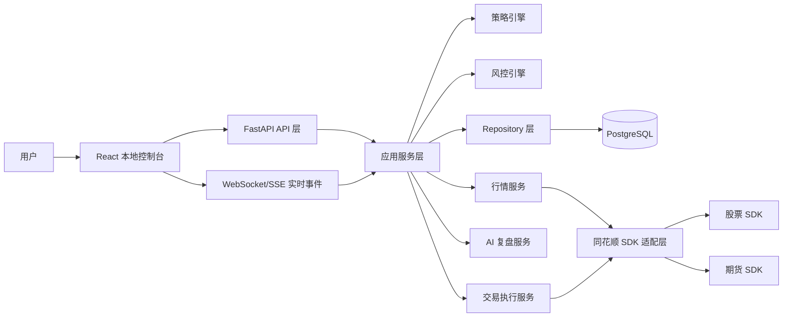
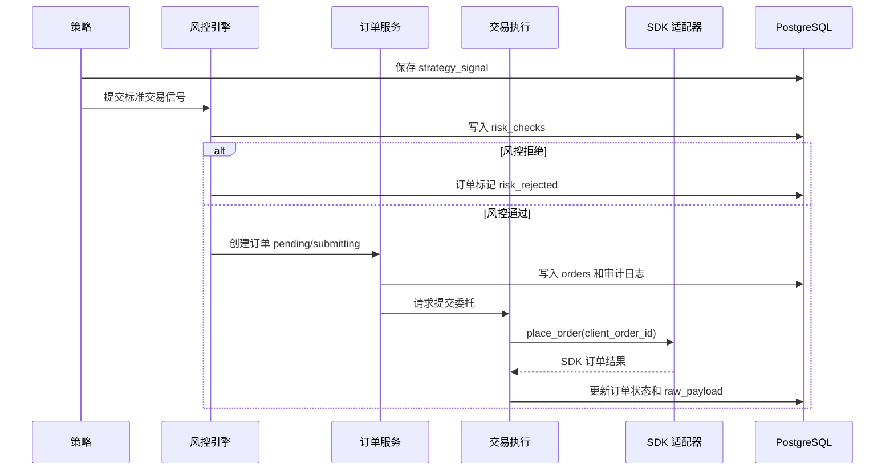

# 总体架构设计

## 目标

系统面向 Windows 单机环境运行，目标是在本机完成行情接入、策略运行、风控校验、实盘委托、交易记录沉淀、可视化监控和 AI 复盘。架构必须优先保证交易链路可追溯、可熔断、可恢复。

## 架构图

## 进程边界

MVP 建议采用以下进程边界：

| 进程 | 职责 |
| --- | --- |
| PostgreSQL | 主数据存储、审计日志、交易事件、配置和 AI 报告 |
| FastAPI 后端 | API、业务编排、策略调度、风控、交易、SDK 适配、后台任务 |
| React 前端 | 本地控制台、配置、监控、人工操作入口 |

第一版后台任务可先使用 FastAPI 进程内任务和 APScheduler。若后续策略数量、AI 任务或同步任务变重，再拆分 Celery worker。

## 模块职责

| 模块 | 主要职责 | 禁止行为 |
| --- | --- | --- |
| API 层 | 入参校验、权限边界、统一响应、调用应用服务 | 直接调用 SDK、直接写复杂业务 SQL |
| 应用服务层 | 编排交易、策略、风控、审计、状态变更 | 绕过 Repository 写库 |
| SDK 适配层 | 封装同花顺股票/期货 SDK 差异，输出标准模型 | 泄露 SDK 原始字段到业务层 |
| 策略引擎 | 加载策略、订阅行情、生成标准交易信号 | 直接提交委托 |
| 风控引擎 | 下单前检查、交易中监控、熔断和恢复 | 被任何交易入口绕过 |
| 交易执行服务 | 调用 SDK 下单、撤单、查询，同步状态 | 在无风控结果时提交新委托 |
| 数据中心 | 持久化订单、成交、资金、持仓、行情、日志 | 修改审计日志历史记录 |
| AI 复盘服务 | 读取历史数据、生成报告、保存结果 | 生成可直接执行的下单指令 |

## 核心业务流

### 启动流

1. 加载本地配置和环境变量。
2. 连接 PostgreSQL。
3. 初始化审计日志、系统状态和调度器。
4. 初始化 Mock SDK 或真实 SDK 适配器。
5. 从数据库恢复未完结订单、策略运行状态和风控状态。
6. 启动 API 和实时事件通道。

### 策略信号到委托流

### 状态同步流

1. SDK 回调订单和成交事件时，适配层转换为标准事件。
2. 交易执行服务按 `client_order_id`、`sdk_order_id`、`sdk_trade_id` 幂等写库。
3. 后台轮询定期查询订单、成交、资金和持仓，与回调结果做一致性校验。
4. 出现重复、缺失、延迟或未知状态时写入 `system_events`，必要时触发降级或熔断。

### 熔断流

1. 风控监控发现阈值触发。
2. 写入 `system_events` 和 `audit_logs`。
3. 系统状态切换为 `circuit_breaker` 或 `emergency_stopped`。
4. 禁止所有新委托。
5. 按配置撤销未成交委托。
6. 保留行情、订单、成交、资金和持仓同步。
7. 需要用户手动确认后恢复。

## 实时事件

前端需要实时展示行情、订单、成交、策略、风控和系统状态。MVP 可使用 WebSocket：

| 事件主题 | 内容 |
| --- | --- |
| system.status | 系统状态、SDK 状态、数据库状态 |
| quote.update | 行情快照 |
| strategy.signal | 策略信号 |
| order.update | 委托状态 |
| trade.update | 成交回报 |
| risk.event | 风控拒绝、熔断、恢复 |
| audit.event | 关键审计事件摘要 |

## 设计约束

1. 交易链路以数据库为事实来源，内存状态只做加速。
2. 所有写操作必须在业务成功或失败后留下审计记录。
3. 后端重启后必须根据数据库恢复系统状态，不能依赖前端状态。
4. 前端关闭不影响策略、风控和交易同步。
5. 真实 SDK 未就绪前必须提供 Mock SDK，保证前后端、数据库和风控可以先行开发。
