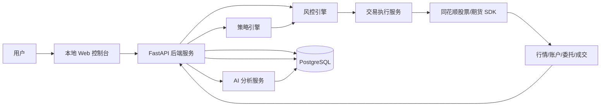

# 量化交易系统产品需求文档

## 1. 文档信息

| 项目 | 内容 |
| --- | --- |
| 产品名称 | Windows 单机版量化交易系统 |
| 文档类型 | 产品需求文档 PRD |
| 目标版本 | MVP v1.0 |
| 目标平台 | Windows 10/11 |
| 后端技术 | Python + FastAPI |
| 前端技术 | React + TypeScript + Vite + Ant Design + ECharts |
| 数据库 | PostgreSQL |
| 交易接入 | 同花顺期货 SDK、同花顺股票 SDK |
| 核心模式 | 全自动实盘交易，强制风控与审计 |

## 2. 产品背景

个人量化交易通常需要同时处理行情获取、策略运行、自动下单、交易记录沉淀、复盘分析和风险控制。现有工具往往分散在行情软件、交易客户端、脚本程序和表格记录中，难以形成稳定闭环。

本系统面向 Windows 本机使用场景，提供一个本地运行的量化交易终端。系统通过同花顺期货和股票 SDK 获取行情、账户、委托、成交和持仓信息，由 Python 后端统一调度策略、执行交易和落库，前端提供实时可视化界面，并基于历史交易数据接入 AI 分析能力，辅助复盘和优化策略。

本产品涉及真实资金交易。MVP 虽然支持全自动实盘，但所有实盘委托必须经过系统风控、审计记录和紧急停止机制，不允许 AI 或策略模块绕过风控直接下单。

## 3. 产品目标

### 3.1 核心目标

1. 打通同花顺期货和股票 SDK，实现行情、账户、委托、成交、持仓的统一接入。
2. 支持策略在本地自动运行，并根据策略信号触发实盘自动交易。
3. 建立强制风控体系，覆盖下单前、交易中和异常场景。
4. 沉淀历史行情、订单、成交、持仓、资金、策略运行和 AI 分析结果。
5. 提供可视化控制台，用于监控行情、策略、交易、风控和系统状态。
6. 基于历史交易数据接入 AI 分析，输出复盘、归因和策略改进建议。

### 3.2 成功标准

1. 用户可以在 Windows 本机启动后端服务、前端控制台和 PostgreSQL 数据库。
2. 用户可以配置同花顺 SDK 账号、接口路径和交易账户参数。
3. 系统可以展示实时行情、账户资金、持仓、委托、成交和策略运行状态。
4. 策略触发交易信号后，系统可以自动完成风控校验、下单、状态跟踪和记录落库。
5. 触发风控阈值时，系统必须拒绝新委托或进入熔断状态。
6. 用户可以查看历史交易记录和 AI 复盘报告。

## 4. 用户与使用场景

### 4.1 目标用户

本产品第一版面向单个个人交易者或个人量化研究者，用户具备基础交易经验和 Windows 本地软件使用能力，能够申请并配置同花顺相关 SDK。

### 4.2 典型场景

1. 用户每天开盘前启动系统，确认 SDK、数据库和策略服务均正常。
2. 用户查看行情看板和账户资金，确认持仓和昨日成交同步完成。
3. 用户启动指定策略，策略根据实时行情生成交易信号。
4. 系统对交易信号进行风控校验，通过后自动向同花顺 SDK 提交委托。
5. 系统持续监听委托状态和成交回报，更新订单、成交和持仓。
6. 交易过程中若触发亏损、频率、仓位或异常连接阈值，系统自动熔断。
7. 收盘后用户查看策略表现、历史成交、收益曲线和 AI 复盘报告。

## 5. 产品范围

### 5.1 MVP 范围

1. Windows 本机部署和运行。
2. 同花顺期货和股票 SDK 的本地适配层。
3. 实时行情订阅和历史行情查询。
4. 策略配置、启停、信号生成和运行监控。
5. 全自动实盘下单、撤单、订单跟踪和成交同步。
6. 下单前风控、交易中监控、异常熔断、一键停止。
7. PostgreSQL 数据存储。
8. Web 可视化控制台。
9. 历史交易数据查询和 AI 复盘分析。

### 5.2 非目标

1. 不做高频交易或毫秒级撮合优化。
2. 不承诺收益，不提供投资建议结论。
3. 不支持多人权限系统。
4. 不直接兼容多个券商或期货商 SDK。
5. 不在 MVP 阶段实现云端托管交易。
6. 不允许 AI 模块绕过策略和风控直接下单。

## 6. 总体架构

### 6.1 架构说明

1. 前端只负责展示、配置和人工操作入口，不直接调用 SDK。
2. 后端通过 FastAPI 提供统一接口，并负责策略调度、交易执行、风控和数据落库。
3. 同花顺 SDK 通过适配层封装，业务模块只依赖统一接口。
4. PostgreSQL 是系统主数据源，所有交易相关事件必须落库。
5. AI 分析服务只读取历史数据和策略结果，输出分析报告，不直接提交交易委托。

## 7. 技术选型

### 7.1 前端

| 技术 | 用途 | 选择原因 |
| --- | --- | --- |
| React | UI 框架 | 生态成熟，适合构建交易控制台 |
| TypeScript | 类型约束 | 降低前端状态和接口字段错误 |
| Vite | 构建工具 | 启动快，适合本地开发 |
| Ant Design | 组件库 | 表格、表单、弹窗、菜单等后台组件完整 |
| ECharts | 图表 | 支持 K 线、收益曲线、资金曲线、成交分布 |
| Tauri | 后续桌面打包 | 可将本地 Web 控制台封装为 Windows 桌面应用 |

### 7.2 后端

| 技术 | 用途 | 选择原因 |
| --- | --- | --- |
| Python | 核心业务语言 | 适合策略、数据分析和 AI 接入 |
| FastAPI | Web API 服务 | 类型友好，性能足够，接口文档自动生成 |
| APScheduler 或 Celery | 任务调度 | 适合定时同步、盘前检查、盘后复盘 |
| SQLAlchemy | ORM | 统一管理数据库模型和查询 |
| Alembic | 数据库迁移 | 管理表结构版本、索引和历史字段补齐 |
| Pydantic | 数据校验 | 用于接口入参、配置和 SDK 返回值规范化 |

### 7.3 数据库

MVP 使用 PostgreSQL 作为主数据库。

选择原因：

1. 交易订单、成交、持仓、资金和审计日志天然适合关系型建模。
2. 支持事务、唯一约束、外键、索引和 JSONB 字段，兼顾强一致与 SDK 原始响应留存。
3. 适合复杂报表查询，如策略收益、成交归因、风控拦截、资金曲线和历史复盘。
4. Windows 环境可使用官方安装包本机安装，也可使用 Docker Desktop 运行。
5. 后续可扩展 TimescaleDB 或独立时序库，用于更高频率的行情时间序列数据。

## 8. 核心模块需求

### 8.1 系统设置

#### 功能描述

用户可以在前端配置系统运行所需参数，包括同花顺 SDK 路径、账号信息、数据库连接、交易账户、策略参数和风控阈值。

#### 关键需求

1. 支持配置股票 SDK 和期货 SDK 的本地路径、连接参数和账号标识。
2. 支持测试 SDK 连接状态。
3. 支持配置数据库连接字符串。
4. 支持配置交易时间段、交易品种白名单、黑名单。
5. 支持配置全局风控参数。
6. 敏感信息如密码、Token、密钥必须加密存储或使用本机环境变量。

#### 验收标准

1. 用户可以在界面保存配置并重新加载。
2. SDK 连接失败时界面展示明确错误信息。
3. 风控配置修改后必须写入审计日志。

### 8.2 行情中心

#### 功能描述

通过同花顺 SDK 获取股票和期货的实时行情、历史行情和基础信息，并在前端展示行情看板。

#### 关键需求

1. 支持股票行情订阅。
2. 支持期货行情订阅。
3. 支持查询历史 K 线数据。
4. 支持展示最新价、涨跌幅、成交量、买卖盘、更新时间。
5. 支持行情异常检测，如长时间无更新、SDK 断线、返回字段异常。
6. 支持将关键行情快照落库，用于策略回放和交易复盘。

#### 验收标准

1. 用户可以选择关注标的并查看实时行情。
2. 行情断线时系统显示告警，并记录异常日志。
3. 历史行情可被策略和 AI 分析模块读取。

### 8.3 策略中心

#### 功能描述

策略中心负责管理策略配置、运行状态、参数、信号和日志。

#### 关键需求

1. 支持策略列表展示，包括名称、状态、适用品种、运行时间、当日盈亏、最后信号。
2. 支持策略启停。
3. 支持策略参数配置，如标的、周期、仓位比例、止盈止损。
4. 支持策略生成标准化交易信号。
5. 策略信号必须进入风控引擎，不能直接调用交易 SDK。
6. 支持策略运行日志和异常日志。
7. 支持盘后统计策略表现，包括收益率、胜率、最大回撤、盈亏比。

#### 标准交易信号字段

| 字段 | 类型 | 说明 |
| --- | --- | --- |
| strategy_id | string | 策略 ID |
| symbol | string | 标的代码 |
| market | enum | stock 或 futures |
| side | enum | buy 或 sell |
| action | enum | open、close、reduce、increase |
| price_type | enum | limit 或 market |
| price | decimal | 委托价格，市价可为空 |
| quantity | decimal | 委托数量 |
| reason | string | 触发原因 |
| signal_time | datetime | 信号时间 |

#### 验收标准

1. 策略启动后可以持续接收行情并生成信号。
2. 所有策略信号均可在前端查询。
3. 策略异常不会导致整个交易系统崩溃。

### 8.4 风控系统

#### 功能描述

风控系统是所有实盘交易的强制关口。任何策略信号、手动交易请求或自动撤单请求都必须经过风控检查。

#### 下单前风控

1. 标的是否在允许交易范围内。
2. 标的是否在黑名单中。
3. 当前时间是否在允许交易时间段内。
4. 单笔委托金额是否超过上限。
5. 单笔委托数量是否超过上限。
6. 标的持仓是否超过上限。
7. 总仓位是否超过上限。
8. 当日累计亏损是否超过熔断阈值。
9. 当日交易次数是否超过限制。
10. 是否处于紧急停止或熔断状态。

#### 交易中风控

1. 监控委托是否长时间未成交。
2. 监控行情是否断线。
3. 监控 SDK 是否断线。
4. 监控账户资金和持仓是否异常。
5. 监控成交回报是否重复、缺失或延迟。
6. 监控策略连续亏损和异常频繁信号。

#### 熔断机制

触发以下任一条件时，系统进入熔断状态：

1. 当日亏损达到配置阈值。
2. SDK 连接异常超过配置时间。
3. 行情数据长时间无更新。
4. 连续下单失败超过阈值。
5. 成交回报与本地订单状态不一致。
6. 用户点击一键停止。

熔断状态下：

1. 禁止提交新委托。
2. 可按配置自动撤销未成交委托。
3. 保留账户、持仓和成交同步。
4. 记录熔断原因和时间。
5. 需要用户手动确认后才能恢复交易。

#### 验收标准

1. 所有实盘委托均能追溯到风控检查结果。
2. 风控拒绝的委托不会调用同花顺 SDK 下单接口。
3. 一键停止在前端可见且可立即切断新委托。

### 8.5 自动交易

#### 功能描述

自动交易模块负责把通过风控的交易请求转换为同花顺 SDK 下单、撤单、查询和成交同步操作。

#### 关键需求

1. 支持股票买入、卖出。
2. 支持期货开仓、平仓、平今、平昨等操作，具体字段以 SDK 能力为准。
3. 支持限价单和 SDK 支持的其他委托类型。
4. 支持撤单。
5. 支持订单状态同步。
6. 支持成交回报同步。
7. 支持持仓同步。
8. 支持资金同步。
9. 支持自动重试，但重试必须受频率和幂等控制。
10. 所有交易动作必须写入审计日志。

#### 订单状态

| 状态 | 说明 |
| --- | --- |
| pending_risk | 等待风控 |
| risk_rejected | 风控拒绝 |
| submitting | 正在提交 SDK |
| submitted | 已提交 |
| partially_filled | 部分成交 |
| filled | 全部成交 |
| cancelled | 已撤单 |
| failed | 下单失败 |
| unknown | 状态未知，需要人工检查 |

#### 验收标准

1. 策略信号通过风控后可以自动提交委托。
2. 委托状态变化能在前端实时更新。
3. SDK 异常时系统不会重复提交同一笔委托。

### 8.6 数据中心

#### 功能描述

数据中心负责存储和查询系统运行过程中的核心数据，支持前端展示、策略回测、交易复盘和 AI 分析。

#### 核心数据表

| 表名 | 说明 |
| --- | --- |
| accounts | 交易账户 |
| instruments | 股票、期货合约基础信息 |
| market_snapshots | 行情快照 |
| kline_bars | 历史 K 线 |
| strategies | 策略定义 |
| strategy_runs | 策略运行实例 |
| strategy_signals | 策略信号 |
| risk_checks | 风控检查记录 |
| orders | 委托订单 |
| trades | 成交记录 |
| positions | 持仓记录 |
| account_assets | 账户资金快照 |
| audit_logs | 审计日志 |
| ai_reports | AI 分析报告 |
| system_events | 系统事件和异常 |

#### 表结构与约束要求

1. orders 表必须使用 client_order_id 作为幂等 ID，并建立唯一约束。
2. trades 表必须对 SDK 成交编号建立唯一约束，避免重复成交回报导致重复入库。
3. market_snapshots 和 kline_bars 必须按 symbol、market、timestamp 建立复合索引。
4. strategy_signals、orders、trades 必须保留 strategy_id，方便按策略复盘。
5. SDK 原始响应可以保存在 raw_payload JSONB 字段，便于排查同花顺接口问题。
6. 审计日志原则上只追加不修改。

#### 数据保留策略

1. 订单、成交、持仓、审计日志永久保留，除非用户手动归档。
2. 行情快照默认保留 1 年，可配置。
3. K 线数据长期保留。
4. AI 报告长期保留。
5. 系统异常日志默认保留 180 天。

#### 验收标准

1. 所有订单和成交都能从数据库追溯。
2. 前端历史交易页面可以按时间、标的、策略、状态筛选。
3. AI 分析模块可以读取交易和策略表现数据。

### 8.7 AI 分析

#### 功能描述

AI 分析模块读取历史交易、策略表现、行情和风控记录，生成交易复盘、风险归因和策略优化建议。

#### 关键需求

1. 支持按自然日、周、月和自定义时间范围生成复盘报告。
2. 支持按策略、标的、市场类型分析表现。
3. 支持分析胜率、盈亏比、最大回撤、连续亏损、滑点、交易频率。
4. 支持识别异常交易，如过度交易、追涨杀跌、连续止损、风控拒绝频繁。
5. 支持输出策略改进建议。
6. AI 报告必须标注数据范围和生成时间。
7. AI 输出仅作为复盘参考，不允许直接触发下单。

#### AI 输入数据

1. 历史订单。
2. 历史成交。
3. 策略信号。
4. 风控检查记录。
5. 账户资金曲线。
6. 持仓变化。
7. 行情 K 线。

#### AI 输出内容

1. 总体表现摘要。
2. 收益与风险指标。
3. 策略表现排名。
4. 亏损交易归因。
5. 风控触发分析。
6. 异常行为提示。
7. 后续优化建议。

#### 验收标准

1. 用户可以选择时间范围并生成 AI 复盘报告。
2. 报告能引用系统中的真实交易统计数据。
3. 报告不会生成直接下单指令。

### 8.8 可视化界面

#### 页面结构

1. 仪表盘。
2. 行情看板。
3. 策略监控。
4. 自动交易。
5. 持仓与账户。
6. 历史交易。
7. AI 分析报告。
8. 风控设置。
9. 系统设置。
10. 系统日志。

#### 仪表盘

展示系统核心状态：

1. SDK 连接状态。
2. 数据库连接状态。
3. 当前交易状态：正常、暂停、熔断、紧急停止。
4. 当日盈亏。
5. 当前持仓市值。
6. 当日交易次数。
7. 运行中的策略数量。
8. 最新告警。

#### 行情看板

1. 自选股票和期货合约列表。
2. 实时价格、涨跌幅、成交量。
3. K 线图。
4. 买卖盘。
5. 行情更新时间。

#### 策略监控

1. 策略列表。
2. 策略启停。
3. 策略参数。
4. 策略信号列表。
5. 策略收益曲线。
6. 策略日志。

#### 自动交易

1. 委托列表。
2. 成交列表。
3. 撤单操作。
4. 风控结果。
5. 一键停止按钮。

#### 历史交易

1. 按日期范围筛选。
2. 按标的筛选。
3. 按策略筛选。
4. 按订单状态筛选。
5. 导出 CSV。
6. 查看单笔交易详情。

#### AI 分析报告

1. 选择分析范围。
2. 生成报告。
3. 查看历史报告。
4. 展示收益、回撤、胜率、盈亏比等图表。
5. 展示 AI 文字分析。

## 9. 同花顺 SDK 适配层

### 9.1 设计目标

SDK 适配层用于隔离同花顺股票和期货 SDK 的差异。业务模块只调用统一接口，避免直接依赖 SDK 原始字段和调用方式。

### 9.2 统一接口

| 接口 | 说明 |
| --- | --- |
| connect | 建立 SDK 连接 |
| disconnect | 断开 SDK 连接 |
| get_account | 查询账户 |
| get_positions | 查询持仓 |
| subscribe_quotes | 订阅行情 |
| get_quote | 获取单个标的行情 |
| get_kline | 查询历史 K 线 |
| place_order | 提交委托 |
| cancel_order | 撤销委托 |
| query_orders | 查询委托 |
| query_trades | 查询成交 |
| on_order_update | 订单状态回调 |
| on_trade_update | 成交回调 |

### 9.3 适配原则

1. 股票和期货各自实现独立 adapter。
2. 所有 SDK 返回值必须转换为系统标准模型。
3. 所有 SDK 异常必须转换为系统标准错误码。
4. 所有下单请求必须携带幂等 ID。
5. 所有回调事件必须落库，避免状态丢失。
6. SDK 原始响应可存入 JSON 字段，方便排查问题。

## 10. API 需求

### 10.1 前端调用后端接口

| 方法 | 路径 | 说明 |
| --- | --- | --- |
| GET | /api/health | 系统健康检查 |
| GET | /api/dashboard | 仪表盘数据 |
| GET | /api/quotes | 行情列表 |
| GET | /api/quotes/{symbol} | 单个标的行情 |
| GET | /api/strategies | 策略列表 |
| POST | /api/strategies/{id}/start | 启动策略 |
| POST | /api/strategies/{id}/stop | 停止策略 |
| GET | /api/signals | 策略信号 |
| GET | /api/orders | 委托列表 |
| POST | /api/orders/{id}/cancel | 撤单 |
| GET | /api/trades | 成交列表 |
| GET | /api/positions | 持仓 |
| GET | /api/assets | 账户资金 |
| GET | /api/risk/status | 风控状态 |
| POST | /api/risk/emergency-stop | 一键停止 |
| POST | /api/risk/resume | 恢复交易 |
| GET | /api/ai/reports | AI 报告列表 |
| POST | /api/ai/reports | 生成 AI 报告 |
| GET | /api/settings | 系统配置 |
| PUT | /api/settings | 更新系统配置 |
| GET | /api/logs | 系统日志 |

### 10.2 API 设计要求

1. 所有接口返回统一响应结构。
2. 所有写操作必须记录审计日志。
3. 交易相关写接口必须校验系统状态和风控状态。
4. 接口错误信息需要区分用户可理解消息和内部调试信息。
5. 前端必须能展示请求失败原因。

## 11. 数据安全与审计

### 11.1 数据安全

1. 数据库仅本机访问，默认不开放公网端口。
2. SDK 账号、密码、Token 不明文写入代码仓库。
3. 前端不保存交易密码。
4. 敏感配置优先使用 Windows 环境变量或加密配置文件。
5. 数据库定期备份到本地指定目录。

### 11.2 审计日志

以下事件必须记录审计日志：

1. 系统启动和关闭。
2. SDK 连接和断开。
3. 策略启动和停止。
4. 策略参数修改。
5. 风控参数修改。
6. 下单请求。
7. 风控拒绝。
8. 委托提交。
9. 撤单请求。
10. 熔断触发。
11. 紧急停止。
12. 恢复交易。
13. AI 报告生成。

审计日志字段至少包括时间、用户动作、模块、对象 ID、结果、原因、原始请求摘要。

## 12. Windows 本地部署需求

### 12.1 本机依赖

1. Windows 10 或 Windows 11。
2. Python 3.11 及以上。
3. Node.js LTS。
4. PostgreSQL 15 及以上。
5. 同花顺股票 SDK。
6. 同花顺期货 SDK。
7. 对应交易账号和 SDK 授权。

### 12.2 启动方式

MVP 允许使用命令行启动：

1. 启动 PostgreSQL。
2. 启动 Python 后端服务。
3. 启动前端开发服务或本地构建产物。
4. 在浏览器访问本地控制台。

后续版本支持：

1. 一键启动脚本。
2. Windows 服务模式。
3. Tauri 桌面客户端。

### 12.3 默认端口

| 服务 | 默认端口 |
| --- | --- |
| 前端控制台 | 5173 |
| 后端 API | 8000 |
| PostgreSQL | 5432 |

## 13. 运行状态与异常处理

### 13.1 系统状态

| 状态 | 说明 |
| --- | --- |
| initializing | 初始化 |
| ready | 就绪 |
| trading | 交易中 |
| paused | 暂停交易 |
| circuit_breaker | 熔断 |
| emergency_stopped | 紧急停止 |
| degraded | 部分功能异常 |
| offline | 离线 |

### 13.2 异常处理要求

1. SDK 断线时自动重连，并记录断线时间。
2. 数据库不可用时暂停新交易请求。
3. 行情停止更新时暂停依赖该行情的策略。
4. 订单状态未知时标记为 unknown，并提示人工检查。
5. 后端服务重启后必须从数据库恢复策略、订单和风控状态。
6. 不允许因为前端关闭而停止后端风控和交易状态同步。

## 14. 指标与报表

### 14.1 交易指标

1. 总收益。
2. 当日收益。
3. 胜率。
4. 盈亏比。
5. 最大回撤。
6. 平均持仓时间。
7. 交易次数。
8. 手续费。
9. 滑点估算。
10. 策略贡献收益。

### 14.2 风控指标

1. 风控拒绝次数。
2. 熔断次数。
3. 紧急停止次数。
4. 超频交易次数。
5. 超仓位拦截次数。
6. SDK 异常次数。
7. 行情断线次数。

## 15. 里程碑

### 15.1 MVP 第一期：基础框架

1. 初始化 Python FastAPI 后端。
2. 初始化 React 前端。
3. 初始化 PostgreSQL 数据库、表结构、索引和迁移脚本。
4. 完成系统配置、健康检查和日志模块。
5. 完成基础页面框架。

### 15.2 MVP 第二期：SDK 与数据

1. 完成同花顺股票 SDK 适配。
2. 完成同花顺期货 SDK 适配。
3. 完成行情订阅和历史行情查询。
4. 完成账户、持仓、委托、成交同步。
5. 完成核心数据表落库。

### 15.3 MVP 第三期：策略与交易

1. 完成策略中心。
2. 完成标准交易信号模型。
3. 完成风控引擎。
4. 完成自动下单、撤单和订单跟踪。
5. 完成紧急停止和熔断。

### 15.4 MVP 第四期：可视化与 AI

1. 完成仪表盘、行情、策略、交易、持仓、历史交易页面。
2. 完成 AI 复盘报告生成。
3. 完成收益曲线和风险指标图表。
4. 完成验收测试和本地部署文档。

## 16. 验收标准

### 16.1 文档验收

1. PRD 包含产品定位、架构、核心模块、数据存储、自动交易、AI 分析、风控和验收标准。
2. 技术选型明确，前后端和数据库职责清晰。
3. 同花顺 SDK 对接边界明确。
4. Windows 本机部署要求明确。

### 16.2 功能验收

1. 系统可以在 Windows 本机启动。
2. 前端可以访问后端健康检查接口。
3. 后端可以连接 PostgreSQL。
4. SDK 连接状态可以在前端显示。
5. 策略信号可以进入风控流程。
6. 风控通过后可以提交委托。
7. 风控拒绝时不会调用 SDK 下单。
8. 订单、成交、持仓和资金可以落库。
9. 用户可以查看历史交易数据。
10. 用户可以生成 AI 复盘报告。

### 16.3 风控验收

1. 所有实盘委托必须有对应风控检查记录。
2. 一键停止后系统不能提交新委托。
3. 当日亏损达到阈值后系统进入熔断状态。
4. SDK 断线超过阈值后系统进入熔断或降级状态。
5. 订单状态未知时系统提示人工检查。

## 17. 风险与约束

| 风险 | 影响 | 应对 |
| --- | --- | --- |
| SDK 文档和授权不完整 | 无法准确实现接口 | 先建立适配层和模拟实现，拿到 SDK 后替换 |
| SDK 回调不稳定 | 订单状态可能不一致 | 定时轮询和回调双通道同步 |
| 网络或客户端异常 | 自动交易中断 | 熔断、重连、状态恢复 |
| 策略误触发 | 造成错误交易 | 参数校验、风控阈值、审计日志 |
| AI 输出误导 | 影响用户判断 | AI 仅做复盘参考，不直接交易 |
| 本机断电或休眠 | 服务停止 | 明确要求交易期间关闭自动休眠，并增加启动恢复 |

## 18. 后续扩展

1. 支持回测系统。
2. 支持模拟盘。
3. 支持更多券商或期货公司接口。
4. 支持 Tauri 桌面端。
5. 支持 TimescaleDB 或独立时序库优化行情数据。
6. 支持策略插件化。
7. 支持本地大模型或云端大模型切换。
8. 支持交易数据自动备份和恢复。
