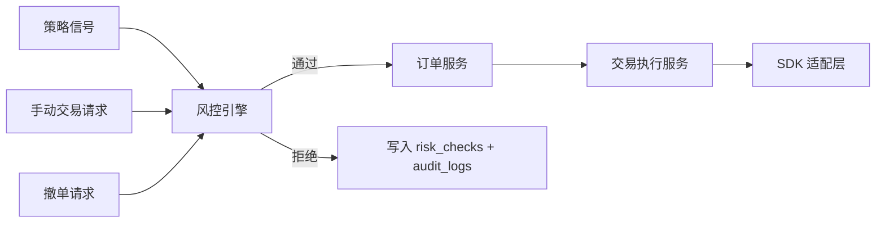

# 风控系统设计

## 目标

风控系统是所有实盘交易的强制关口。策略信号、手动交易请求和自动撤单请求都必须经过风控或交易状态校验。任何模块不得直接调用 SDK 下单接口。

## 风控入口



## 系统状态

| 状态 | 是否允许新委托 | 说明 |
| --- | --- | --- |
| `initializing` | 否 | 初始化中 |
| `ready` | 可按配置允许 | 就绪但未交易 |
| `trading` | 是 | 正常交易 |
| `paused` | 否 | 暂停交易 |
| `circuit_breaker` | 否 | 熔断 |
| `emergency_stopped` | 否 | 紧急停止 |
| `degraded` | 视规则而定 | 部分功能异常 |
| `offline` | 否 | 离线 |

## 下单前规则

规则建议按以下顺序执行，前置状态规则失败后可直接拒绝：

| 规则码 | 检查项 | 拒绝条件 |
| --- | --- | --- |
| `RISK_SYSTEM_STATE` | 系统状态 | 非允许交易状态 |
| `RISK_SYMBOL_WHITELIST` | 白名单 | 标的不在允许范围 |
| `RISK_SYMBOL_BLACKLIST` | 黑名单 | 标的在黑名单 |
| `RISK_TRADING_SESSION` | 交易时间 | 当前不在允许时段 |
| `RISK_ORDER_AMOUNT_LIMIT` | 单笔金额 | 数量 * 价格超过上限 |
| `RISK_ORDER_QUANTITY_LIMIT` | 单笔数量 | 委托数量超过上限 |
| `RISK_SYMBOL_POSITION_LIMIT` | 标的仓位 | 标的持仓超过上限 |
| `RISK_TOTAL_POSITION_LIMIT` | 总仓位 | 总持仓超过上限 |
| `RISK_DAILY_LOSS_LIMIT` | 当日亏损 | 达到熔断阈值 |
| `RISK_DAILY_TRADE_COUNT` | 当日交易次数 | 超过次数限制 |
| `RISK_DUPLICATE_SIGNAL` | 重复信号 | 短时间重复提交同类信号 |

每条风控检查都应写入 `risk_checks`，至少保存最终结果。对拒绝场景必须保存具体规则码、原因和检查快照。

## 交易中监控

| 监控项 | 触发行为 |
| --- | --- |
| 委托长时间未成交 | 标记告警，可按配置自动撤单 |
| 行情长时间无更新 | 暂停依赖该行情的策略，严重时熔断 |
| SDK 断线 | 自动重连，超时后降级或熔断 |
| 账户资金异常 | 暂停新委托并提示人工检查 |
| 持仓异常 | 暂停相关标的交易 |
| 成交回报重复 | 幂等处理并记录事件 |
| 成交回报缺失或延迟 | 轮询补偿，严重时标记订单 unknown |
| 连续下单失败 | 达到阈值后熔断 |
| 策略异常频繁信号 | 暂停策略并记录风险事件 |

## 熔断条件

任一条件满足即进入 `circuit_breaker`：

1. 当日亏损达到阈值。
2. SDK 连接异常超过配置时间。
3. 行情数据长时间无更新。
4. 连续下单失败超过阈值。
5. 成交回报与本地订单状态不一致。
6. 用户点击一键停止时可进入 `emergency_stopped`。

熔断后：

1. 禁止提交新委托。
2. 按配置撤销未成交委托。
3. 继续同步账户、持仓、订单和成交。
4. 写入 `audit_logs` 和 `system_events`。
5. 需要用户手动确认后恢复。

## 恢复流程

恢复交易必须满足：

1. 系统状态不是 `initializing` 或 `offline`。
2. 数据库连接正常。
3. SDK 连接正常，或用户选择只恢复非交易功能。
4. 未知订单已处理或用户确认继续。
5. 当前风控指标低于恢复阈值。
6. 用户在前端提交恢复原因。

恢复操作必须写审计日志。

## 风控配置

| 参数 | 说明 |
| --- | --- |
| allowed_symbols | 允许交易标的 |
| blocked_symbols | 禁止交易标的 |
| trading_sessions | 允许交易时段 |
| max_order_amount | 单笔委托金额上限 |
| max_order_quantity | 单笔委托数量上限 |
| max_symbol_position | 单标的仓位上限 |
| max_total_position | 总仓位上限 |
| daily_loss_limit | 当日亏损熔断阈值 |
| daily_trade_count_limit | 当日交易次数上限 |
| sdk_disconnect_timeout_seconds | SDK 断线容忍时间 |
| quote_stale_timeout_seconds | 行情停更容忍时间 |
| consecutive_order_fail_limit | 连续下单失败阈值 |
| auto_cancel_on_breaker | 熔断后是否自动撤单 |

## 验收用例

1. 非交易时段提交信号，系统拒绝且不调用 SDK。
2. 标的在黑名单中，系统拒绝且写入风险记录。
3. 单笔金额超过阈值，系统拒绝并提示具体原因。
4. 当日亏损达到阈值后，系统进入熔断状态。
5. 一键停止后，任何新委托都被拒绝。
6. SDK 断线超过阈值，系统进入降级或熔断。
7. 风控通过后，订单能关联到对应 `risk_checks`。
8. 重复信号不会生成重复实盘委托。

---

## 状态迁移矩阵

| 当前状态 \ 目标 | ready | trading | paused | circuit_breaker | emergency_stopped | degraded | offline |
| --- | --- | --- | --- | --- | --- | --- | --- |
| initializing | 手动 | - | - | - | - | - | - |
| ready | - | 用户启动 | 用户暂停 | 自动 | 用户停止 | 自动 | 关闭 |
| trading | - | - | 用户暂停 | 自动 | 用户停止 | 自动 | - |
| paused | - | 用户恢复 | - | 自动 | 用户停止 | - | - |
| circuit_breaker | - | 用户恢复(需校验) | - | - | 用户停止 | - | - |
| emergency_stopped | - | 用户恢复(需校验) | - | - | - | - | - |
| degraded | - | 用户恢复 | 用户暂停 | 自动 | 用户停止 | - | - |

非法迁移必须抛 `RISK_INVALID_STATE_TRANSITION`。

## 风控规则类骨架

> 放 `backend/app/services/risk_rules.py`。每条规则一个类，便于单测和扩展。

```python
from abc import ABC, abstractmethod
from dataclasses import dataclass
from decimal import Decimal
from datetime import datetime
from ..sdk.models import PlaceOrderRequest
from ..schemas.enums import RiskResult


@dataclass
class RiskContext:
    """风控检查上下文：包含检查所需的所有只读快照。"""
    request: PlaceOrderRequest
    system_status: str
    risk_config: dict           # risk_configs 表当前值
    account_asset: dict         # 当前账户资金
    positions: list[dict]       # 当前持仓
    today_trade_count: int
    today_pnl: Decimal
    recent_signals: list[dict]  # 近 N 秒信号（用于重复检测）
    now: datetime


@dataclass
class RuleResult:
    rule_code: str
    result: str                 # passed / rejected / warning
    reason: str = ""


class RiskRule(ABC):
    rule_code: str

    @abstractmethod
    def check(self, ctx: RiskContext) -> RuleResult:
        ...


class SystemStateRule(RiskRule):
    rule_code = "RISK_SYSTEM_STATE"
    ALLOWED = {"trading"}

    def check(self, ctx: RiskContext) -> RuleResult:
        if ctx.system_status in self.ALLOWED:
            return RuleResult(self.rule_code, "passed")
        return RuleResult(self.rule_code, "rejected",
                          f"系统状态 {ctx.system_status} 不允许提交新委托")


class SymbolWhitelistRule(RiskRule):
    rule_code = "RISK_SYMBOL_WHITELIST"

    def check(self, ctx: RiskContext) -> RuleResult:
        allowed = set(ctx.risk_config.get("allowed_symbols", []))
        # 空白名单 = 不限制
        if not allowed or ctx.request.symbol in allowed:
            return RuleResult(self.rule_code, "passed")
        return RuleResult(self.rule_code, "rejected", f"{ctx.request.symbol} 不在白名单")


class SymbolBlacklistRule(RiskRule):
    rule_code = "RISK_SYMBOL_BLACKLIST"

    def check(self, ctx: RiskContext) -> RuleResult:
        if ctx.request.symbol in set(ctx.risk_config.get("blocked_symbols", [])):
            return RuleResult(self.rule_code, "rejected", f"{ctx.request.symbol} 在黑名单")
        return RuleResult(self.rule_code, "passed")


class TradingSessionRule(RiskRule):
    rule_code = "RISK_TRADING_SESSION"

    def check(self, ctx: RiskContext) -> RuleResult:
        sessions = ctx.risk_config.get("trading_sessions", [])
        # sessions 形如 [{"start":"09:30","end":"11:30","days":["mon","tue",...]}]
        from .time_utils import is_in_session
        if is_in_session(ctx.now, sessions):
            return RuleResult(self.rule_code, "passed")
        return RuleResult(self.rule_code, "rejected", "当前不在允许交易时段")


class OrderAmountRule(RiskRule):
    rule_code = "RISK_ORDER_AMOUNT_LIMIT"

    def check(self, ctx: RiskContext) -> RuleResult:
        price = ctx.request.price or Decimal("0")
        amount = price * ctx.request.quantity
        limit = Decimal(str(ctx.risk_config.get("max_order_amount", 0)))
        if amount > limit:
            return RuleResult(self.rule_code, "rejected",
                              f"单笔金额 {amount} 超过上限 {limit}")
        return RuleResult(self.rule_code, "passed")


class OrderQuantityRule(RiskRule):
    rule_code = "RISK_ORDER_QUANTITY_LIMIT"

    def check(self, ctx: RiskContext) -> RuleResult:
        limit = Decimal(str(ctx.risk_config.get("max_order_quantity", 0)))
        if ctx.request.quantity > limit:
            return RuleResult(self.rule_code, "rejected",
                              f"单笔数量 {ctx.request.quantity} 超过上限 {limit}")
        return RuleResult(self.rule_code, "passed")


class SymbolPositionRule(RiskRule):
    rule_code = "RISK_SYMBOL_POSITION_LIMIT"

    def check(self, ctx: RiskContext) -> RuleResult:
        limit = Decimal(str(ctx.risk_config.get("max_symbol_position", 0)))
        pos_qty = sum(
            Decimal(str(p["quantity"])) for p in ctx.positions
            if p["symbol"] == ctx.request.symbol
        )
        # 简化：买入时累加委托数量判断
        new_qty = pos_qty + ctx.request.quantity if ctx.request.side == "buy" else pos_qty
        if new_qty > limit:
            return RuleResult(self.rule_code, "rejected",
                              f"标的 {ctx.request.symbol} 持仓 {new_qty} 超过上限 {limit}")
        return RuleResult(self.rule_code, "passed")


class TotalPositionRule(RiskRule):
    rule_code = "RISK_TOTAL_POSITION_LIMIT"

    def check(self, ctx: RiskContext) -> RuleResult:
        limit = Decimal(str(ctx.risk_config.get("max_total_position", 0)))
        total = sum(Decimal(str(p.get("market_value", 0))) for p in ctx.positions)
        # 买入时计入本次新委托敞口（price * quantity）
        side = ctx.request.side.value if hasattr(ctx.request.side, "value") else ctx.request.side
        if side == "buy":
            price = ctx.request.price or ctx.latest_price or Decimal("0")
            if price > 0:
                total += price * ctx.request.quantity
        if limit > 0 and total > limit:
            return RuleResult(self.rule_code, "rejected",
                              f"总仓位 {total} 超过上限 {limit}")
        return RuleResult(self.rule_code, "passed")


class DailyLossRule(RiskRule):
    rule_code = "RISK_DAILY_LOSS_LIMIT"

    def check(self, ctx: RiskContext) -> RuleResult:
        limit = Decimal(str(ctx.risk_config.get("daily_loss_limit", 0)))
        if ctx.today_pnl < 0 and abs(ctx.today_pnl) >= limit:
            return RuleResult(self.rule_code, "rejected",
                              f"当日亏损 {abs(ctx.today_pnl)} 达到熔断阈值 {limit}")
        return RuleResult(self.rule_code, "passed")


class DailyTradeCountRule(RiskRule):
    rule_code = "RISK_DAILY_TRADE_COUNT"

    def check(self, ctx: RiskContext) -> RuleResult:
        limit = int(ctx.risk_config.get("daily_trade_count_limit", 0))
        if ctx.today_trade_count >= limit:
            return RuleResult(self.rule_code, "rejected",
                              f"当日交易次数 {ctx.today_trade_count} 超过上限 {limit}")
        return RuleResult(self.rule_code, "passed")


class DuplicateSignalRule(RiskRule):
    rule_code = "RISK_DUPLICATE_SIGNAL"

    def check(self, ctx: RiskContext) -> RuleResult:
        window = int(ctx.risk_config.get("duplicate_signal_window_seconds", 3))
        cutoff = ctx.now.timestamp() - window
        for s in ctx.recent_signals:
            if (s["strategy_id"] == ctx.request.metadata.get("strategy_id")
                and s["symbol"] == ctx.request.symbol
                and s["side"] == ctx.request.side
                and s["action"] == ctx.request.action
                and s.get("ts", 0) >= cutoff):
                return RuleResult(self.rule_code, "rejected", "短时间重复信号")
        return RuleResult(self.rule_code, "passed")


# 规则注册顺序（前置失败后可短路）
RULES_ORDERED = [
    SystemStateRule, SymbolWhitelistRule, SymbolBlacklistRule,
    TradingSessionRule, OrderAmountRule, OrderQuantityRule,
    SymbolPositionRule, TotalPositionRule, DailyLossRule,
    DailyTradeCountRule, DuplicateSignalRule,
]
```

## 风控服务骨架

> 放 `backend/app/services/risk_service.py`。

```python
from datetime import datetime, timezone
from .risk_rules import RULES_ORDERED, RiskContext, RuleResult
from .audit_service import AuditService
from ..repositories.risk_repo import RiskRepository
from ..sdk.models import PlaceOrderRequest


class RiskService:
    def __init__(self, db, audit: AuditService):
        self.db = db
        self.audit = audit
        self.repo = RiskRepository(db)

    def check(self, request: PlaceOrderRequest, *, signal_id=None) -> tuple[bool, list[RuleResult]]:
        """执行所有风控规则。返回 (是否通过, 所有规则结果)。"""
        ctx = self._build_context(request)
        results = []
        passed = True
        for RuleCls in RULES_ORDERED:
            r = RuleCls().check(ctx)
            results.append(r)
            if r.result == "rejected":
                passed = False
                break  # 短路：前置规则失败不再检查后续

        # 写 risk_checks（至少存最终结果；拒绝场景存具体规则码与快照）
        overall = "passed" if passed else "rejected"
        hit_rule = next((r for r in results if r.result == "rejected"), None)
        self.repo.add(
            signal_id=signal_id, client_order_id=request.client_order_id,
            result=overall, rule_code=hit_rule.rule_code if hit_rule else "",
            reason=hit_rule.reason if hit_rule else "",
            checked_at=datetime.now(timezone.utc),
            snapshot={"config": ctx.risk_config, "asset": ctx.account_asset,
                      "positions": ctx.positions[:5]},
        )
        self.audit.log(action="risk_check", module="risk",
                       object_type="signal", object_id=str(signal_id or ""),
                       result=overall, reason=hit_rule.reason if hit_rule else "all rules passed",
                       request_summary={"client_order_id": request.client_order_id,
                                        "symbol": request.symbol, "side": request.side})
        return passed, results

    def _build_context(self, request: PlaceOrderRequest) -> RiskContext:
        # 从各 repo 拉取当前快照，组装 RiskContext
        ...  # 实现略：查 risk_configs、account_assets 最新、positions 最新、今日 trades 计数、今日 pnl、近 N 秒 signals
        return RiskContext(...)

    # ---- 熔断与一键停止 ----
    def emergency_stop(self, reason: str, cancel_open_orders: bool) -> dict:
        ...

    def trigger_breaker(self, reason: str) -> None:
        ...

    def resume(self, reason: str) -> dict:
        """恢复前置校验，全部满足才解除。"""
        blockers = []
        if self._has_unknown_orders():
            blockers.append("存在 unknown 状态订单未处理")
        if not self._sdk_healthy():
            blockers.append("SDK 未连接")
        if not self._db_healthy():
            blockers.append("数据库不可用")
        if blockers:
            raise BizError("RISK_RESUME_BLOCKED", "恢复被阻止", debug=str(blockers))
        ...  # 状态迁移 + 审计
```

## 风控配置样例

> 存 `risk_configs` 表（单行）。初始默认值见 `database-design.md` 迁移 5。前端可编辑，保存二次确认 + 审计。

```json
{
  "allowed_symbols": ["600000.SH", "600519.SH", "IF2409", "rb2409"],
  "blocked_symbols": ["ST001.SH"],
  "trading_sessions": [
    {"start": "09:30", "end": "11:30", "days": ["mon","tue","wed","thu","fri"]},
    {"start": "13:00", "end": "15:00", "days": ["mon","tue","wed","thu","fri"]},
    {"start": "21:00", "end": "23:30", "days": ["sun","mon","tue","wed","thu"], "markets": ["futures"]}
  ],
  "max_order_amount": 1000000,
  "max_order_quantity": 10000,
  "max_symbol_position": 100000,
  "max_total_position": 1000000,
  "daily_loss_limit": 50000,
  "daily_trade_count_limit": 100,
  "sdk_disconnect_timeout_seconds": 30,
  "quote_stale_timeout_seconds": 10,
  "consecutive_order_fail_limit": 5,
  "duplicate_signal_window_seconds": 3,
  "auto_cancel_on_breaker": true
}
```

## 熔断监控任务骨架

> 放 `backend/app/workers/breaker_monitor.py`。

```python
from apscheduler.schedulers.asyncio import AsyncIOScheduler
from ..services.risk_service import RiskService


def register_breaker_monitor(scheduler: AsyncIOScheduler, db_factory):
    """每 10 秒检查一次熔断条件。"""
    @scheduler.scheduled_job("interval", seconds=10, id="breaker_check")
    async def check():
        db = db_factory()
        try:
            svc = RiskService(db, ...)
            # 1. 当日亏损
            if svc._today_loss_exceeds_limit():
                svc.trigger_breaker("当日亏损达到阈值")
            # 2. SDK 断线超时
            if svc._sdk_disconnected_too_long():
                svc.trigger_breaker("SDK 断线超时")
            # 3. 行情停更
            if svc._quotes_stale():
                svc.trigger_breaker("行情长时间无更新")
            # 4. 连续下单失败
            if svc._consecutive_fail_exceeds():
                svc.trigger_breaker("连续下单失败超过阈值")
            # 5. 订单状态不一致
            if svc._order_state_inconsistent():
                svc.trigger_breaker("成交回报与订单状态不一致")
        finally:
            db.close()
```
