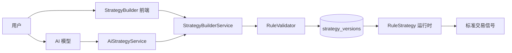
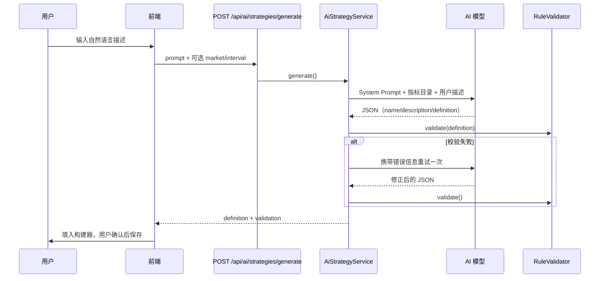

# 策略构建器与规则 DSL 设计

## 目标

用户无需编写 Python 代码，通过可视化表单或 **AI 自然语言** 定义策略规则。定义以 JSON DSL 存储在 `strategy_versions.definition`，由 `RuleStrategy` 统一解释执行。

与内置 Python 策略（`kind=builtin`）并列，用户规则策略为 `kind=rule`，支持草稿 → 发布 → 版本管理。

## 架构



| 模块 | 路径 | 职责 |
| --- | --- | --- |
| DSL 常量 | `backend/app/strategies/rule_schema.py` | 操作符、指标类型、默认模板 |
| 校验器 | `backend/app/strategies/rule_validator.py` | 结构、引用、资源限制 |
| 公式引擎 | `backend/app/strategies/formula_evaluator.py` | 安全表达式求值（禁止 eval） |
| 规则求值 | `backend/app/strategies/rule_evaluator.py` | 运行时条件判断 |
| 运行时 | `backend/app/strategies/rule_strategy.py` | K 线驱动、信号生成 |
| 构建服务 | `backend/app/services/strategy_builder_service.py` | CRUD、发布、克隆 |
| AI 生成 | `backend/app/services/ai_strategy_service.py` | 自然语言 → DSL JSON |
| 前端 | `frontend/src/pages/StrategyBuilder.tsx` | 八步向导 + AI 面板 |

## DSL 结构（schema_version: 1）

```json
{
  "schema_version": 1,
  "market": "stock",
  "interval": "1d",
  "parameters": {
    "fast": { "type": "integer", "default": 5, "min": 2, "max": 100 }
  },
  "indicators": [
    { "id": "fast_ma", "type": "sma", "source": "close", "period": { "parameter": "fast" } }
  ],
  "formulas": [
    { "id": "ma_diff", "expression": "@fast_ma - @slow_ma" }
  ],
  "entry_rule": { "all": [{ "operator": "cross_above", "left": {...}, "right": {...} }] },
  "exit_rule": { "any": [{ "operator": "cross_below", "left": {...}, "right": {...} }] },
  "execution": { "quantity": { "parameter": "quantity" }, "cooldown_bars": 1 },
  "symbols": { "mode": "runtime", "list": [], "max_concurrent": 5 },
  "risk": { "stop_loss_pct": "5", "take_profit_pct": "10", "max_position_pct": "30" }
}
```

### 指标（indicators）

完整目录通过 `GET /api/indicator-catalog` 获取（26 种）。按类别：

**趋势 / 均线**

| type | 输出 | period | 附加 params |
| --- | --- | --- | --- |
| sma / ema / wma / hma | value | 需要 | — |
| adx | value, plus_di, minus_di | 需要 | — |
| parabolic_sar | value | 不需要 | step, max_step |
| supertrend | value, direction | 需要 | multiplier |
| ichimoku | tenkan, kijun, senkou_a, senkou_b | 不需要 | tenkan, kijun, senkou_b |

**动量**

| type | 输出 | period | 附加 params |
| --- | --- | --- | --- |
| rsi / roc / cci / williams_r / mfi | value | 需要 | — |
| macd | value, signal, histogram | 不需要 | fast, slow, signal |
| kdj | k, d, j | 需要 | — |
| stoch_rsi | k, d | 需要 | stoch_period, k_smooth, d_smooth |
| ao | value | 不需要 | fast, slow |

**波动率**

| type | 输出 | period | 附加 params |
| --- | --- | --- | --- |
| bollinger | value, upper, lower, width, pct_b | 需要 | std_dev |
| atr | value | 需要 | — |
| keltner | value, upper, lower | 需要 | multiplier |
| donchian | value, upper, lower | 需要 | — |

**成交量**

| type | 输出 | period | 附加 params |
| --- | --- | --- | --- |
| volume_sma / vwap / cmf | value | 需要 | — |
| obv / ad_line | value | 不需要 | — |

指标可指定 `interval` 使用更高周期 K 线（如 5m 策略引用 1d 均线），详见 `RuleStrategy._refresh_htf_indicators`。

### 操作符（operator）

| operator | 含义 | 字段 |
| --- | --- | --- |
| gt / gte / lt / lte / eq | 比较 | left, right |
| cross_above / cross_below | 上穿 / 下穿 | left, right |
| between | 介于 | target, low, high |
| rising / falling | 上升 / 下降 | operand |
| percent_change_gte / percent_change_lte | 涨幅/跌幅 ≥ 阈值% | operand, right |
| has_position / no_position | 有/无持仓 | 无 |
| bar_since_gte | 距上次信号 ≥ N 根 K 线 | bars（整数） |

### 操作数（operand）

| 类型 | JSON | 示例 |
| --- | --- | --- |
| 指标 | `{ "indicator": "id", "output": "value" }` | RSI 值 |
| 价格字段 | `{ "field": "close" }` | 收盘价 |
| 滚动极值 | `{ "field": "high", "lookback": 20 }` | 最近 20 根最高价 |
| 常量 | `{ "constant": "30" }` | 阈值 |
| 参数 | `{ "parameter": "fast" }` | 可调参数 |
| 公式 | `{ "formula": "ma_diff" }` | 自定义因子 |

滚动 lookback 支持 `high` / `low` / `close` 字段，范围 1–500。

### 规则树

- `{ "all": [...] }`：全部满足（AND）
- `{ "any": [...] }`：任一满足（OR）
- `{ "not": ... }`：取反

### 公式表达式

引用语法（见 `FORMULA_REF_HELP`）：

- `@指标id` 或 `@指标id.输出` — 指标值
- `$close` — OHLCV 字段（open/high/low/close/volume）
- `#参数名` — 策略参数
- `&公式id` — 其他公式

支持运算符：`+ - * / ( )`

### 资源限制

| 限制 | 值 |
| --- | --- |
| 指标数量 | ≤ 30 |
| 条件数量 | ≤ 50 |
| 规则嵌套深度 | ≤ 5 |
| 公式数量 | ≤ 10 |
| 公式长度 | ≤ 200 字符 |
| period / lookback | 1–500 |
| 固定标的 | ≤ 20 |
| max_concurrent | 1–10 |

## 策略构建流程

1. **基本信息**：名称、描述、市场、K 线周期
2. **标的范围**：`runtime`（启动时指定）或 `fixed`（固定列表）
3. **指标**：从目录选择并配置
4. **公式因子**（可选）：组合指标或价格
5. **买入规则**：entry_rule 规则树
6. **卖出规则**：exit_rule 规则树
7. **执行与风控**：数量/仓位比例、冷却 K 线、止损止盈
8. **摘要与发布**：校验 → 保存草稿 → 发布

发布后的版本方可回测与启动；运行中策略不可修改定义。

## AI 自然语言生成

### 能力

用户在策略构建页第一步点击 **「AI 生成策略」**，用中文描述交易逻辑，后端调用已配置的 AI 模型，输出完整 `definition` JSON。

- **不生成 Python 代码**，只生成 DSL JSON
- 自动注入 `GET /api/indicator-catalog` 目录供模型参考
- 生成后经 `RuleValidator` 校验；失败时自动重试修正一次
- 用户可在各步骤微调后再保存/发布

### 安全边界

1. AI **只输出策略定义 JSON**，不调用 SDK、不下单、不启动策略
2. 生成结果必须通过后端的 `RuleValidator` 才能被用户采纳
3. 与 AI 复盘共用 `ai_client` 配置（系统设置 / 环境变量）
4. 未配置 AI 时返回 `AI_STRATEGY_NOT_CONFIGURED`，不静默降级
5. 审计动作：`ai_strategy_generate` / `ai_strategy_failed`

### 生成流程



### 请求示例

```json
POST /api/ai/strategies/generate
{
  "prompt": "日线双均线，5日上穿20日买入，下穿卖出，每次100股，止损5%止盈10%",
  "market": "stock",
  "interval": "1d"
}
```

### 响应示例

```json
{
  "name": "双均线金叉",
  "description": "快线上穿慢线买入，下穿卖出",
  "definition": { "schema_version": 1, "...": "..." },
  "validation": { "valid": true, "errors": [] },
  "model_name": "gpt-4o-mini"
}
```

### 自然语言映射速查

| 用户说法 | DSL 字段 |
| --- | --- |
| 日线 / 5 分钟 | `interval`: `1d` / `5m` |
| 股票 / 期货 | `market`: `stock` / `futures` |
| 买 100 股 | `execution.quantity` |
| 用 20% 资金 | `execution.quantity_pct` |
| 止损 5% | `risk.stop_loss_pct`: `"5"` |
| 金叉 / 上穿 | `operator`: `cross_above` |
| 且 / 或 | `all` / `any` |

完整操作符与指标组合示例见 `AiStrategyService` 内 `SYSTEM_PROMPT` 及本文件 §DSL 结构。

## API 一览

| 方法 | 路径 | 说明 |
| --- | --- | --- |
| GET | `/api/indicator-catalog` | 指标/操作符/公式帮助目录 |
| POST | `/api/strategies` | 创建规则策略（含 definition） |
| PUT | `/api/strategies/{id}` | 更新草稿定义 |
| POST | `/api/strategies/{id}/validate` | 校验 definition |
| POST | `/api/strategies/{id}/publish` | 发布版本 |
| POST | `/api/strategies/{id}/clone` | 克隆 |
| POST | `/api/strategies/{id}/archive` | 归档 |
| GET | `/api/strategies/{id}/versions` | 版本列表 |
| GET | `/api/strategies/{id}/versions/{ver}` | 版本详情（含 definition） |
| POST | `/api/ai/strategies/generate` | AI 自然语言生成定义 |

## 错误码

| 错误码 | 说明 |
| --- | --- |
| `AI_STRATEGY_NOT_CONFIGURED` | 未配置 AI Provider / API Key |
| `AI_STRATEGY_PROMPT_EMPTY` | 描述为空 |
| `AI_STRATEGY_FAILED` | 模型调用失败（可重试） |
| `AI_STRATEGY_INVALID_OUTPUT` | 返回非 JSON 或缺少 definition |
| `STRATEGY_PARAM_INVALID` | DSL 校验失败（保存/发布时） |

## 验收用例

1. 手动构建双均线策略，校验通过，发布后可回测。
2. 配置 AI 后，自然语言「RSI 低于 30 买入高于 70 卖出」生成有效 definition。
3. AI 未配置时，前端提示配置路径，不崩溃。
4. 生成 definition 校验失败时，前端展示 errors，用户可手动修正。
5. 已发布规则策略启动后，按 entry/exit 规则产生信号并进入风控。

## 相关文档

- [strategy-design.md](strategy-design.md) — 策略生命周期与信号模型
- [ai-analysis-design.md](ai-analysis-design.md) — AI 复盘（与策略生成共用客户端）
- [api-spec.md](api-spec.md) — 接口出入参
- [frontend-design.md](frontend-design.md) — StrategyBuilder 页面
