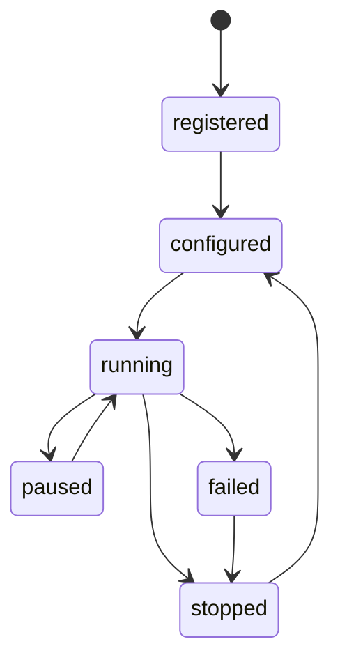

# 策略中心设计

## 目标

策略中心负责管理策略定义、参数、生命周期、行情订阅、信号生成和运行日志。策略只能输出标准交易信号，不允许直接调用订单服务或 SDK。

## 策略生命周期



| 状态 | 说明 |
| --- | --- |
| registered | 策略已注册 |
| configured | 参数已配置 |
| running | 正在运行 |
| paused | 暂停接收行情或暂停发信号 |
| stopped | 已停止 |
| failed | 运行异常 |

## 策略接口

```python
class Strategy:
    strategy_id: str
    name: str

    def configure(self, parameters: dict) -> None: ...
    def on_start(self, context: StrategyContext) -> None: ...
    def on_quote(self, quote: QuoteSnapshot) -> list[TradeSignal]: ...
    def on_bar(self, bar: KlineBar) -> list[TradeSignal]: ...
    def on_order_update(self, event: OrderUpdateEvent) -> None: ...
    def on_stop(self) -> None: ...
```

策略上下文只提供：

1. 当前配置。
2. 只读行情和历史数据查询。
3. 只读账户、持仓和策略自身状态。
4. 日志接口。
5. 信号提交接口。

禁止在策略上下文中暴露 SDK 下单、数据库写入和风控绕过能力。

## 标准交易信号

| 字段 | 类型 | 说明 |
| --- | --- | --- |
| signal_id | uuid | 信号 ID |
| strategy_id | string | 策略 ID |
| symbol | string | 标的代码 |
| market | enum | `stock` 或 `futures` |
| side | enum | `buy` 或 `sell` |
| action | enum | `open`、`close`、`reduce`、`increase` |
| price_type | enum | `limit` 或 `market` |
| price | decimal | 委托价格 |
| quantity | decimal | 委托数量 |
| reason | string | 触发原因 |
| signal_time | datetime | 信号时间 |
| metadata | object | 策略扩展信息 |

信号生成后先落库，再进入风控。

## 参数管理

策略参数应以 JSON Schema 或 Pydantic 模型声明，便于前端动态生成表单和后端校验。

常见参数：

| 参数 | 说明 |
| --- | --- |
| symbols | 交易标的 |
| interval | 使用周期 |
| position_ratio | 仓位比例 |
| max_position | 最大持仓 |
| take_profit | 止盈阈值 |
| stop_loss | 止损阈值 |
| enabled_sessions | 允许运行时段 |

参数修改必须写审计日志。运行中修改参数建议先暂停策略或在下一根 K 线生效。

## 运行隔离

1. 单个策略异常不能导致整个后端崩溃。
2. 策略异常应记录到 `system_events` 和策略运行日志。
3. 策略连续异常达到阈值后自动停止。
4. 策略运行状态保存到 `strategy_runs`。
5. 后端重启后默认不自动恢复实盘策略，需要用户确认。

## 信号去重

策略引擎应防止短时间重复信号：

1. 同一策略、标的、方向、动作、价格和数量在配置窗口内重复时标记为重复。
2. 重复信号可以落库用于排查，但不应进入实盘风控。
3. 去重规则必须可配置，并写入风控或系统事件。

## MVP 示例策略

第一阶段建议提供一个 Mock 示例策略：

1. 订阅 Mock 行情。
2. 根据价格穿越阈值生成信号。
3. 支持参数配置。
4. 信号进入风控和 Mock 交易链路。
5. 用于端到端验收，不用于真实交易。

## 盘后统计

盘后任务按策略计算：

1. 收益率。
2. 胜率。
3. 最大回撤。
4. 盈亏比。
5. 交易次数。
6. 平均持仓时间。
7. 风控拒绝次数。
8. 连续亏损次数。

统计结果写入 `strategy_runs.metrics` 或独立报表表，供前端和 AI 复盘读取。

---

## 策略基类骨架

> 放 `backend/app/strategies/base.py`。

```python
from abc import ABC, abstractmethod
from typing import Any
from pydantic import BaseModel
from ..sdk.models import QuoteSnapshot, KlineBar, OrderUpdateEvent


class StrategyParamSchema(BaseModel):
    """策略参数 schema，子类用 Pydantic 模型声明参数。前端据此动态生成表单。"""
    pass


class Strategy(ABC):
    """策略抽象基类。子类只生成信号，不接触订单/SDK/数据库。"""

    strategy_id: str
    name: str
    description: str = ""
    param_schema: type[StrategyParamSchema] = StrategyParamSchema
    supported_markets: list[str] = ["stock", "futures"]

    def __init__(self, parameters: dict):
        self.parameters = self.param_schema(**parameters)
        self.context: "StrategyContext | None" = None

    @abstractmethod
    def on_start(self, context: "StrategyContext") -> None: ...

    @abstractmethod
    def on_quote(self, quote: QuoteSnapshot) -> list["TradeSignal"]: ...

    @abstractmethod
    def on_bar(self, bar: KlineBar) -> list["TradeSignal"]: ...

    def on_order_update(self, event: OrderUpdateEvent) -> None:
        """默认空实现，子类可覆盖。"""
        pass

    @abstractmethod
    def on_stop(self) -> None: ...

    def log(self, level: str, message: str, **extra):
        if self.context:
            self.context.log(level, message, **extra)
```

## 策略上下文骨架

> 放 `backend/app/strategies/context.py`。**只暴露只读能力 + 信号提交**，严禁暴露 SDK/订单服务/数据库写。

```python
from datetime import datetime
from decimal import Decimal
from typing import Any
from uuid import uuid4
from ..sdk.models import KlineBar, QuoteSnapshot, Market, OrderSide, SignalAction, PriceType


class StrategyContext:
    """策略运行上下文。只读数据 + 信号提交。"""

    def __init__(self, *, strategy_id: str, run_id: str, parameters: dict,
                 market_data_reader, account_reader, signal_sink, logger):
        self.strategy_id = strategy_id
        self.run_id = run_id
        self.parameters = parameters
        self._market_reader = market_data_reader   # 只读行情/K线查询
        self._account_reader = account_reader       # 只读账户/持仓
        self._signal_sink = signal_sink             # 信号提交回调（交给 strategy_service）
        self._logger = logger

    # ---- 只读数据 ----
    def get_klines(self, symbol: str, interval: str, limit: int = 100) -> list[KlineBar]:
        return self._market_reader.get_klines(symbol, interval, limit)

    def get_quote(self, symbol: str) -> QuoteSnapshot | None:
        return self._market_reader.get_quote(symbol)

    def get_position(self, symbol: str) -> dict | None:
        return self._account_reader.get_position(symbol)

    def get_account(self) -> dict:
        return self._account_reader.get_account()

    # ---- 信号提交 ----
    def submit_signal(self, *, symbol: str, market: Market, side: OrderSide,
                      action: SignalAction, price_type: PriceType,
                      quantity: Decimal, price: Decimal | None = None,
                      reason: str = "", metadata: dict | None = None) -> str:
        """生成标准信号并交给 strategy_service 落库 + 进风控。返回 signal_id。"""
        signal_id = str(uuid4())
        self._signal_sink(
            signal_id=signal_id, strategy_id=self.strategy_id,
            symbol=symbol, market=market, side=side, action=action,
            price_type=price_type, price=price, quantity=quantity,
            reason=reason, signal_time=datetime.now(),
            metadata=metadata or {},
        )
        return signal_id

    # ---- 日志 ----
    def log(self, level: str, message: str, **extra):
        self._logger(level, self.strategy_id, message, extra)
```

## 标准信号 schema

> 放 `backend/app/schemas/signal.py`。

```python
from datetime import datetime
from decimal import Decimal
from uuid import UUID
from pydantic import BaseModel
from .enums import Market, OrderSide, SignalAction, PriceType


class TradeSignal(BaseModel):
    signal_id: UUID
    strategy_id: str
    symbol: str
    market: Market
    side: OrderSide
    action: SignalAction
    price_type: PriceType
    price: Decimal | None = None
    quantity: Decimal
    reason: str = ""
    signal_time: datetime
    metadata: dict = {}
```

## 策略注册表骨架

> 放 `backend/app/strategies/registry.py`。

```python
from .base import Strategy

_REGISTRY: dict[str, type[Strategy]] = {}


def register(strategy_cls: type[Strategy]):
    _REGISTRY[strategy_cls.strategy_id] = strategy_cls
    return strategy_cls


def get_strategy_class(strategy_id: str) -> type[Strategy]:
    if strategy_id not in _REGISTRY:
        raise KeyError(f"策略未注册: {strategy_id}")
    return _REGISTRY[strategy_id]


def list_strategies() -> list[type[Strategy]]:
    return list(_REGISTRY.values())
```

## 示例策略：双均线交叉

> 放 `backend/app/strategies/samples/ma_cross.py`。

```python
from collections import deque
from decimal import Decimal
from pydantic import BaseModel, Field
from ..base import Strategy, StrategyParamSchema
from ..context import StrategyContext
from ..registry import register
from ...sdk.models import (QuoteSnapshot, KlineBar, Market, OrderSide,
                            SignalAction, PriceType, TradeSignal)


class MaCrossParams(StrategyParamSchema):
    symbols: list[str] = Field(default_factory=lambda: ["600000.SH"])
    interval: str = "5m"
    fast: int = 5
    slow: int = 20
    quantity: Decimal = Decimal("100")


@register
class MaCrossStrategy(Strategy):
    strategy_id = "ma_cross"
    name = "双均线交叉"
    description = "快线上穿慢线买入，下穿卖出"
    param_schema = MaCrossParams
    supported_markets = ["stock", "futures"]

    def __init__(self, parameters: dict):
        super().__init__(parameters)
        self._closes: dict[str, deque] = {}  # symbol -> 收盘价序列

    def on_start(self, context: StrategyContext) -> None:
        self.context = context
        for s in self.parameters.symbols:
            self._closes[s] = deque(maxlen=self.parameters.slow)
            # 预加载历史 K 线
            bars = context.get_klines(s, self.parameters.interval, self.parameters.slow)
            for b in bars:
                self._closes[s].append(b.close)
        context.log("info", f"ma_cross 启动，监控 {self.parameters.symbols}")

    def on_quote(self, quote: QuoteSnapshot) -> list[TradeSignal]:
        return []  # 该策略用 K 线驱动，不在 tick 上发信号

    def on_bar(self, bar: KlineBar) -> list[TradeSignal]:
        if bar.symbol not in self._closes:
            return []
        closes = self._closes[bar.symbol]
        closes.append(bar.close)
        if len(closes) < self.parameters.slow:
            return []

        close_list = list(closes)
        fast_ma = sum(close_list[-self.parameters.fast:]) / self.parameters.fast
        slow_ma = sum(close_list[-self.parameters.slow:]) / self.parameters.slow
        # 上根 K 线的均线值（判断交叉）
        if len(close_list) >= self.parameters.slow + 1:
            prev_fast = sum(close_list[-self.parameters.fast-1:-1]) / self.parameters.fast
            prev_slow = sum(close_list[-self.parameters.slow-1:-1]) / self.parameters.slow
            signals = []
            # 金叉：快线从下方穿到上方
            if prev_fast <= prev_slow and fast_ma > slow_ma:
                sid = self.context.submit_signal(
                    symbol=bar.symbol, market=bar.market, side=OrderSide.BUY,
                    action=SignalAction.OPEN, price_type=PriceType.LIMIT,
                    price=bar.close, quantity=self.parameters.quantity,
                    reason=f"金叉 fast={fast_ma:.2f} slow={slow_ma:.2f}")
                signals.append(sid)
            # 死叉：快线从上方穿到下方
            elif prev_fast >= prev_slow and fast_ma < slow_ma:
                sid = self.context.submit_signal(
                    symbol=bar.symbol, market=bar.market, side=OrderSide.SELL,
                    action=SignalAction.CLOSE, price_type=PriceType.LIMIT,
                    price=bar.close, quantity=self.parameters.quantity,
                    reason=f"死叉 fast={fast_ma:.2f} slow={slow_ma:.2f}")
                signals.append(sid)
            return signals
        return []

    def on_stop(self) -> None:
        self.context.log("info", "ma_cross 停止")
```

## 策略引擎骨架

> 放 `backend/app/services/strategy_service.py`。负责生命周期、行情分发、信号落库与转交风控。

```python
from datetime import datetime, timezone
from ..strategies.registry import get_strategy_class
from ..strategies.context import StrategyContext
from ..repositories.strategy_repo import StrategyRepository, StrategyRunRepository, SignalRepository
from .audit_service import AuditService
from .risk_service import RiskService
from .order_service import OrderService
from ..sdk.models import QuoteSnapshot, KlineBar, OrderUpdateEvent


class StrategyService:
    def __init__(self, db, audit: AuditService, risk: RiskService,
                 order: OrderService, market_reader, account_reader):
        self.db = db
        self.audit = audit
        self.risk = risk
        self.order = order
        self.market_reader = market_reader
        self.account_reader = account_reader
        self.strategy_repo = StrategyRepository(db)
        self.run_repo = StrategyRunRepository(db)
        self.signal_repo = SignalRepository(db)
        self._running: dict[str, object] = {}  # strategy_id -> 运行实例

    def start(self, strategy_id: str, params: dict, symbols: list[str]) -> dict:
        if strategy_id in self._running:
            raise BizError("STRATEGY_ALREADY_RUNNING", "策略已在运行")
        cls = get_strategy_class(strategy_id)
        instance = cls(params)
        run = self.run_repo.create(strategy_id=strategy_id, status="running",
                                    started_at=datetime.now(timezone.utc),
                                    parameters=params)
        ctx = StrategyContext(
            strategy_id=strategy_id, run_id=str(run.id), parameters=params,
            market_data_reader=self.market_reader, account_reader=self.account_reader,
            signal_sink=lambda **kw: self._on_signal(run.id, **kw),
            logger=self._log,
        )
        instance.on_start(ctx)
        self._running[strategy_id] = (instance, ctx)
        self.audit.log(action="strategy_start", module="strategy",
                       object_type="strategy_run", object_id=str(run.id),
                       result="success", request_summary={"strategy_id": strategy_id, "params": params})
        return {"run_id": str(run.id), "status": "running"}

    def stop(self, strategy_id: str, reason: str, cancel_open_orders: bool) -> dict:
        if strategy_id not in self._running:
            raise BizError("STRATEGY_NOT_RUNNING", "策略未运行")
        instance, ctx = self._running.pop(strategy_id)
        instance.on_stop()
        self.run_repo.finish(strategy_id, status="stopped", reason=reason)
        self.audit.log(action="strategy_stop", module="strategy",
                       object_type="strategy", object_id=strategy_id,
                       result="success", reason=reason)
        return {"status": "stopped"}

    def dispatch_quote(self, quote: QuoteSnapshot):
        """行情到来时分发给所有运行中策略。"""
        for instance, ctx in self._running.values():
            try:
                instance.on_quote(quote)
            except Exception as e:
                ctx.log("error", f"on_quote 异常: {e}")
                self._on_strategy_error(instance.strategy_id, e)

    def dispatch_bar(self, bar: KlineBar):
        for instance, ctx in self._running.values():
            try:
                instance.on_bar(bar)
            except Exception as e:
                ctx.log("error", f"on_bar 异常: {e}")
                self._on_strategy_error(instance.strategy_id, e)

    def _on_signal(self, run_id: str, **signal_fields):
        """信号落库 + 转交风控。"""
        sig = self.signal_repo.add(run_id=run_id, **signal_fields)
        self.audit.log(action="strategy_signal", module="strategy",
                       object_type="signal", object_id=str(sig.signal_id),
                       result="success", request_summary={**signal_fields})
        # 进入风控
        from ..sdk.models import PlaceOrderRequest
        req = PlaceOrderRequest(
            client_order_id=f"lh_{sig.signal_time:%Y%m%d}_{sig.signal_id.hex[:8]}",
            account_id=..., market=sig.market, symbol=sig.symbol,
            side=sig.side, action=sig.action, price_type=sig.price_type,
            price=sig.price, quantity=sig.quantity,
            metadata={"strategy_id": sig.strategy_id},
        )
        passed, results = self.risk.check(req, signal_id=sig.signal_id)
        if passed:
            self.order.create_from_signal(sig, req)

    def _on_strategy_error(self, strategy_id: str, exc: Exception):
        """策略异常：记录事件，连续异常达阈值自动停止。"""
        ...  # 写 system_events，计数，超阈值调 self.stop(strategy_id, "连续异常自动停止")
```

## 策略参数 schema 导出（供前端动态表单）

```python
# 启动时把所有策略的 param_schema 导出给前端
def get_strategy_meta() -> list[dict]:
    from ..strategies.registry import list_strategies
    return [{
        "strategy_id": cls.strategy_id,
        "name": cls.name,
        "description": cls.description,
        "supported_markets": cls.supported_markets,
        "parameters_schema": cls.param_schema.model_json_schema(),
    } for cls in list_strategies()]
```

前端 `GET /api/strategies` 返回的 `parameters_schema` 即来自此处，用 `@rjsf/core` 或 Ant Design `Form` + 自渲染即可动态生成参数表单。
